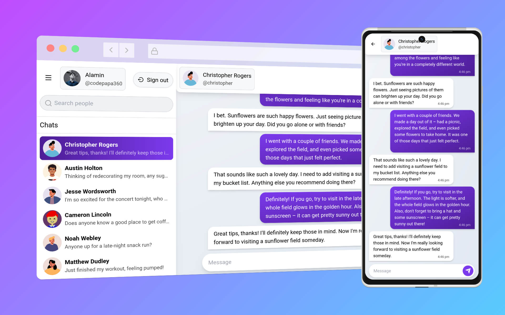

<div align="center">

  

  <h3>
    <a href="https://convayto.vercel.app">
      <strong>Live Demo</strong>
    </a>
  </h3>

  <p>A modern real-time chat application built with React and Supabase</p>

  <div align="center">
    <a href="https://github.com/CodeWithAlamin/Convayto/issues">Report Bug</a>
    •
    <a href="https://github.com/CodeWithAlamin/Convayto/pulls">Submit PR</a>
    •
    <a href="CONTRIBUTING.md">Contributing Guide</a>
  </div>

  <hr>

</div>

<br/>

<!-- Badges -->
<div align="center">

[](https://x.com/CodeWithAlamin)
[](https://www.linkedin.com/in/CodeWithAlamin)


</div>

<p align="center">
  <strong>Convayto</strong> is an open-source real-time chat application demonstrating modern React and Supabase patterns. 
  Perfect for learning full-stack web development—and contributions are always welcome!
</p>

<!-- Screenshot -->
<a align="center" href="https://convayto.vercel.app">
  
</a>

## ✨ Features

- **Secure Authentication** - Email verification, password reset, session management
- **Real-Time Messaging** - Instant message delivery with Supabase Realtime
- **Profile Management** - Customizable profiles with avatar support
- **Friend Search** - Discover and connect with other users
- **Responsive Design** - Perfect on desktop, tablet, and mobile
- **Dark Mode** - Light and dark theme support
- **Optimized Performance** - Infinite pagination and smart data prefetching

## 🚀 Quick Start

### Try the Live Demo

Visit [convayto.vercel.app](https://convayto.vercel.app) to see it in action.

### Run Locally (For Development)

**Prerequisites:** Node.js 16+, npm, Git, Supabase account (free tier works!)

**Steps:**

```bash
# 1. Clone and install
git clone https://github.com/CodeWithAlamin/Convayto.git
cd Convayto
npm install

# 2. Set up environment variables
cp .env.example .env.local
# Edit .env.local with your Supabase credentials

# 3. Start development server
npm run dev

# 4. Open http://localhost:5173
```

**Get your Supabase credentials:**

1. Create account at [supabase.com](https://supabase.com)
2. Create a new project
3. Go to Settings → API
4. Copy `URL` and `Anon` key into `.env.local`

For more detailed setup instructions, see [CONTRIBUTING.md](CONTRIBUTING.md).

## 📚 Documentation

| Document                                 | Purpose                                                |
| ---------------------------------------- | ------------------------------------------------------ |
| [CONTRIBUTING.md](CONTRIBUTING.md)       | How to contribute, development setup, code style       |
| [ARCHITECTURE.md](ARCHITECTURE.md)       | Codebase organization, design patterns, best practices |
| [DATABASE_DESIGN.md](DATABASE_DESIGN.md) | Database schema, security, data flow                   |

## 🛠 Tech Stack

| Category     | Technology                           |
| ------------ | ------------------------------------ |
| **Frontend** | React 18, Vite                       |
| **Styling**  | Tailwind CSS                         |
| **Routing**  | React Router v6                      |
| **Data**     | React Query, Supabase Realtime       |
| **Forms**    | React Hook Form                      |
| **Backend**  | Supabase (PostgreSQL, Auth, Storage) |
| **UI**       | react-hot-toast, react-icons         |

## 📁 Project Structure

```
src/
├── components/          # Reusable UI components
├── features/            # Feature modules (auth, messaging, etc.)
├── contexts/            # Global state (UI Context)
├── services/            # Supabase integration
├── utils/               # Utilities and custom hooks
├── styles/              # Tailwind and global CSS
├── config.js            # App configuration
└── App.jsx              # Main app with routing
```

See [ARCHITECTURE.md](ARCHITECTURE.md) for detailed structure and patterns.

## 🔒 Security

- **Row-Level Security**: Database enforces access control
- **Authentication**: Supabase Auth with email verification
- **Protected Routes**: Only authenticated users access `/chat`
- **Open Source**: Code transparency for security review

For detailed security info, see [DATABASE_DESIGN.md](DATABASE_DESIGN.md).

## 🎯 Learning Goals

This project demonstrates:

- Real-time data synchronization
- Modern React patterns (hooks, custom hooks, context)
- Form validation and error handling
- Responsive design
- Database design with Row-Level Security
- API integration and data fetching
- User authentication flows

Perfect for learning full-stack web development!

## 🤝 Contributing

We'd love your help! Whether it's:

- Reporting bugs
- Adding features
- Improving documentation
- UI/UX improvements
- Accessibility fixes

**Start here:** [CONTRIBUTING.md](CONTRIBUTING.md)

### Common Tasks

```bash
npm run dev        # Start development
npm run build      # Build for production
npm run lint       # Check code style
npm run preview    # Preview production build
```

## 📋 Future Roadmap

- [ ] Message editing and deletion
- [ ] Message reactions with emojis
- [ ] File and image sharing
- [ ] Push notifications
- [ ] Typing indicators
- [ ] User presence (online/offline status)
- [ ] Message threads
- [ ] User blocking
- [ ] TypeScript migration
- [ ] Automated tests

See [Contributing Guide](CONTRIBUTING.md) for details on how to help!

## License

Licensed under the [Apache License 2.0](LICENSE.md). You're free to use, modify, and distribute this code.

## Author

**Alamin** - Full-stack web developer learning and building in public

- Twitter: [@CodeWithAlamin](https://x.com/CodeWithAlamin)
- LinkedIn: [CodeWithAlamin](https://www.linkedin.com/in/CodeWithAlamin)
- GitHub: [@CodeWithAlamin](https://github.com/CodeWithAlamin)

## Contributors

Huge thanks to everyone who has contributed to Convayto!

[View all contributors](https://github.com/CodeWithAlamin/Convayto/graphs/contributors)

Want to join? See [CONTRIBUTING.md](CONTRIBUTING.md) to get started!

## Support

- [Open an issue](https://github.com/CodeWithAlamin/Convayto/issues) for bugs or questions
- [Start a discussion](https://github.com/CodeWithAlamin/Convayto/discussions) for ideas
- Read the [architecture docs](ARCHITECTURE.md) for questions about code

---

<div align="center">

Made as a learning project

[Star this repo](https://github.com/CodeWithAlamin/Convayto) if you find it helpful!

</div>
